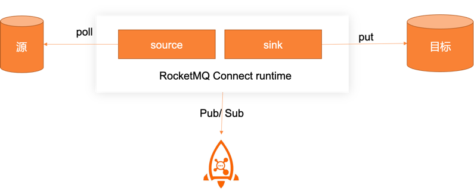
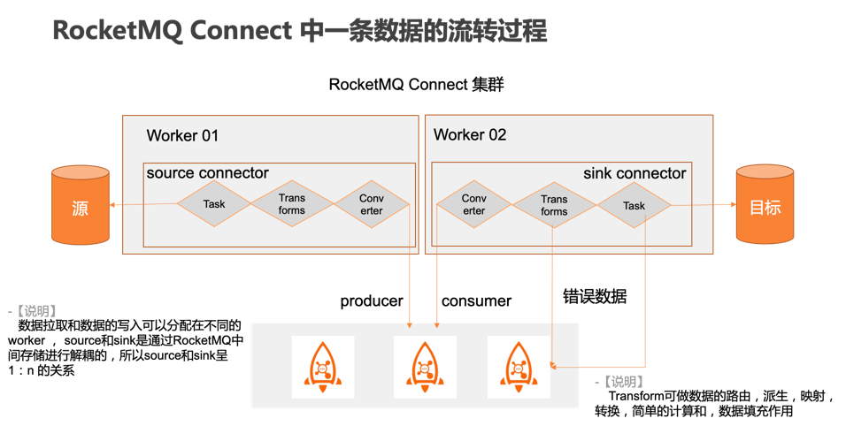

## 简介
> RocketMQ Connect是一种特别强大的数据流处理的工具，属于RocketMQ生态的一部分，有了它，我们可以将RocketMQ同其它的数据技术（例，mysql , elasticsearch、Hudi等）轻松的进行结合，RocketMQ Connect使用 source插件将数据发送到RocketMQ的Topic中，并可通过sink 监听 Topic将数据写入到下游的数据存储中，过程中无需代码即可实现RocketMQ与其它技术的整合

## 特性
- 通用性
> 通过source和sink api规范化了其它数据系统和RocketMQ的集成，简化了连接器的开发、部署和管理
- 断点续传
> 自动管理位移的提交，不需要开发人员干预；当任务停止或者服务停机升级，重新启动任务会从上次保存的位点进行消费
- 分布式，高可用
> 分布式模式下，支持任务的分布式部署，通过简单hash或者一致性hash的方式在集群中对任务进行均匀分布，当一个worker宕机，任务会进行重新平衡到其它的worker节点中，保证了任务的正常运行
- 支持API管理
> RocketMQ Connect提供了丰富的connector集群任务管理的api ，包含但不限于任务添加，启停、列表等操作，帮助用户自定义管理后台
- 批流一体
> RocketMQ Connect可将批处理转换成流的统一形式进行数据的传输和集成
- 支持Standalone/Distributed两种模式：
> RocketMQ Connect支持两种模式，分别是Standalone 和 Distributed,Standalone主要用于测试环境，Distributed用于生产环境
- 支持Dead Letter Queue:
> RocketMQ Connect Sink 支持处理运行过程中出现的错误的数据进入指定的topic，用于错误数据的监听和手工修复
## 组件
- Worker
> 执行连接器和任务运行进程
- Connector
> 通过管理任务来协调数据流的高级抽象
- Task
> 分为SourceTask定义如何从数据源中poll数据到RocketMQ Topic中。SinkTask定义如何将Topic数据写入到对应的目标数据源中
- Record Converter
> 用于在RocketMQ Connect 和发送或接收数据的系统之间进行数据的转换
- Transform
> 改变由连接器产生或发送到连接器的每条消息的简单逻辑，如映射，过滤，路由，重命名等操作，可设置多个
## 一条数据的流转


## 版本升级

### api升级[openmessaging/openconnect] 
- [增强] https://github.com/openmessaging/openconnect/issues/41
```
1.统一struct构建方式，帮助快速完成struct的构建
2.优化task api, 精细化api , 减少实现中暴露的空方法
3.增加offset writer的抽象
4.增强SchemaBuilder能力，支持array、map类型构建，=

```
- [新特性] https://github.com/openmessaging/openconnect/issues/43

```
增加错误上报的api，允许 sink task 自定义上报错误数据信息到指定的错误topic中

```

-[增强] https://github.com/openmessaging/openconnect/issues/51

```
优化SourceTask commit 上报api , 允许透出record 发送相关属性，帮助用户自维护offset信息
```

-[增强] https://github.com/openmessaging/openconnect/issues/53
```
增加 key field用来表示数据的唯一性，并用来保证有序 
```

### Runtimme升级

-[新特性] https://github.com/apache/rocketmq-connect/issues/93
```
Debezium插件支持, 支持在RocketMQ下面使用无缝使用debezium 及 transform来进行数据的拉取和转换
```
-[Bug] https://github.com/apache/rocketmq-connect/issues/143
```
 修复offset上报问题，保证相同名称的connector在集群中上报的名称是
```

-[增强] https://github.com/apache/rocketmq-connect/issues/147
```
> Transformchain 添加 stop 方法， 用于在connector关闭时卸载自定义的对象和关闭自定义的连接
```

-[新特性] https://github.com/apache/rocketmq-connect/issues/153
```
> rocketmq-connect-jdbc升级，增加jdbc插件抽象，通过spi方式扩展对不同存储的支持
```

-[新特性] https://github.com/apache/rocketmq-connect/issues/155
 
增加RecordConverter，实现传输数据的转换，目前支持一下内置Record Converter

***自定义***： 实现io.openmessaging.connector.api.data.RecordConverter

``` 
[Json     ] org.apache.rocketmq.connect.runtime.converter.record.json.JsonConverter
[String   ] org.apache.rocketmq.connect.runtime.converter.record.StringConverter
[Short    ] org.apache.rocketmq.connect.runtime.converter.record.ShortConverter
[Long     ] org.apache.rocketmq.connect.runtime.converter.record.LongConverter
[Integer  ] org.apache.rocketmq.connect.runtime.converter.record.IntegerConverter
[Float    ] org.apache.rocketmq.connect.runtime.converter.record.FloatConverter
[Double   ] org.apache.rocketmq.connect.runtime.converter.record.DoubleConverter
[ByteArray] org.apache.rocketmq.connect.runtime.converter.record.ByteArrayConverter
```

-[增强] https://github.com/apache/rocketmq-connect/issues/183

```
[ 1.] 优化WorkerSourceTask 和 WorkerSinkTask，抽象状态管理
[ 2.] 优化CommitRecord，允许用户自定义 offset 维护方式
[ 3.] WorkerSourceTask offset 提交保证有序
[ 4.] WorkerSourceTask 增加 topic检查和创建的功能，用于支持单任务多topic路由支持
[ 5.] WorkerDirectTask 优化 offset 提交
```

-[增强] https://github.com/apache/rocketmq-connect/issues/207
```
[ 1.] ConnectRecord增加Key字段的定义，用于维护传输数据的唯一标识，标识可以是数据表的主键，可以是通过transform生成的UUID或者是通过transform组装的联合主键
[ 2.] RecordConverter支持key的序列化和反序列化
```

-[增强] https://github.com/apache/rocketmq-connect/issues/223

添加一些常用的transform，方便大家可以按照模板去实现自己的transform

```
org.apache.rocketmq.connect.transforms.ChangeCase$Key 
org.apache.rocketmq.connect.transforms.ChangeCase$Value 
org.apache.rocketmq.connect.transforms.ExtractNestedField$Value 
org.apache.rocketmq.connect.transforms.ExtractNestedField$Key 
org.apache.rocketmq.connect.transforms.PatternRename$Key 
org.apache.rocketmq.connect.transforms.PatternRename$Value 
org.apache.rocketmq.connect.transforms.PatternFilter$Key 
org.apache.rocketmq.connect.transforms.PatternFilter$Value 
org.apache.rocketmq.connect.transforms.SetMaximumPrecision$Key 
org.apache.rocketmq.connect.transforms.SetMaximumPrecision$Value
```

-[增强] https://github.com/apache/rocketmq-connect/issues/230
```
[ 1.] 添加Converter和Transform的加载
[ 2.] 添加一些必要的校验
[ 3.] 提供rest API获取插件列表
```

-[增强] https://github.com/apache/rocketmq-connect/issues/233
```
实现相同key数据的发送是有序的；满足业务应用中同一条数据的CRUD可以按照时间线发送
```

-[新特性] https://github.com/apache/rocketmq-connect/issues/238
```
[ 1.] 优化WorkerSourceTask 增加 pause 和 resume的功能，提供source task 状态上报能力
[ 2.] 优化WorkerSinkTask 并将 Rocketmq Consumer 替换成DefaultLitePullConsumer, 以使用 pause 、resume 及seek 功能，优化commit 提交流程，提供sink task状态上报能力
[ 3.] 优化WorkerConnector, 增加 pause 和 resume 维护功能，提供connector 状态上报能力
[ 4.] 增加 StateManagementService 状态管理服务，帮助缓存和向集群传输connector 和 task 任务的状态，并用于rest api状态透出
[ 5.] 优化ConfigManagementServiceImpl，将异步每次发送全量配置改为每次只发送变更connector，为了解决配置任务过多而触发的消息body的限制，每次任务的变更以监听的消息为准
[ 6.] 优化AbstractConnectController 添加接口供rest api使用
[ 7.] 标准化rest api ，javalin 升级到>4.6 ，规范了api返回的数据格式，增加了pause 和resume 功能api实现
```

-[新特性] https://github.com/apache/rocketmq-connect/issues/255
```
统一配置、更新使用文档
```
| 原配置                | 新配置                | 描述                    |
|:-------------------|:-------------------|-----------------------|
| connector-class    | connector.class    |                       |
| max-tasks          | max.tasks          |                       |
| value-converter    | value.converter    |                       |
| key-converter      | key.converter      |                       |
| connect-topicname  | connect.topicname  | source指定发送topic       |
| connect-topicnames | connect.topicnames | sink 订阅topic，多个用","分割 |
| task-group-id      | task.group.id      |                       |

## Restful接口

### 集群信息
+ 查看集群节点信息：
```
curl -X GET http://(your worker ip):(port)/getClusterInfo
```

+ 重新加载Connector插件目录下的Connector包：

```
curl -X GET http://(your worker ip):(port)/plugin/reload
```

### Connector/Task管理

+ 创建或更新connector（存在且配置不同会更新，不存在创建）
```
curl -X GET http://(your worker ip):(port)/connectors/{connectorName}
```
+ Pause(暂停)指定的connector
```
curl -X GET http://(your worker ip):(port)/connectors/{connectorName}/pause
```
+ Resume(重启)指定的connector
```
curl -X GET http://(your worker ip):(port)/connectors/{connectorName}/resume
```
+ Pause(暂停)所有的connector
```
curl -X GET http://(your worker ip):(port)/connectors/pause/all
```

+ Resume(重启)所有的connector
```
curl -X GET http://(your worker ip):(port)/connectors/resume/all
```

+ 停止并删除指定的connector(谨慎使用)
```
curl -X GET http://(your worker ip):(port)/connectors/{connectorName}/stop
```
+ 停止并删除所有的connector(谨慎使用)
```
curl -X GET http://(your worker ip):(port)/connectors/stop/all
```

+ 列举集群中所有connector信息
```
curl -X GET http://(your worker ip):(port)/connectors/list
```
+ 根据connectorName获取connector的配置信息
```
curl -X GET http://(your worker ip):(port)/connectors/{connectorName}/config
```
+ 根据connectorName获取connector的状态
```
curl -X GET http://(your worker ip):(port)/connectors/{connectorName}/status
```
+ 根据connectorName获取connector下所有task信息
```
curl -X GET http://(your worker ip):(port)/connectors/{connectorName}/tasks
```

+ 根据connectorName和task id获取task状态
```
curl -X GET http://(your worker ip):(port)/connectors/{connectorName}/tasks/{task}/status
```

+ 获取当前worker分配的connector信息
```
curl -X GET http://(your worker ip):(port)/allocated/connectors
```

+ 获取当前worker分配的task信息
```
curl -X GET http://(your worker ip):(port)/allocated/tasks
```


## 未来规划

* 支持 Schema registry
> 适配io.openmessaging.connector.api.data.RecordConverter, 优先支持json、avro两种方式
* 支持 Compact topic
> RocketMQ Connect 存储支持Compact topic
* Converter 替换成 RecordConverter
> 将存储中使用的Converter全部替换成RecordConverter，全局统一，只维护一种转换方式
* Jdbc插件持续扩展
> 计划增加 pg、oracle、sqlserver等关系型数据库的支持，非关系型数据库按需扩展
* Debezium持续扩展
> 增加增量快照的方式的配置案例
> 计划支持自定义新的数据库CDC模式的更新 
* WorkerSourceTask 支持 exactly-once的提交方式
> 当前的模式是最少一次提交，当前模式下只能保证数据不丢，无法保证恰好一次


