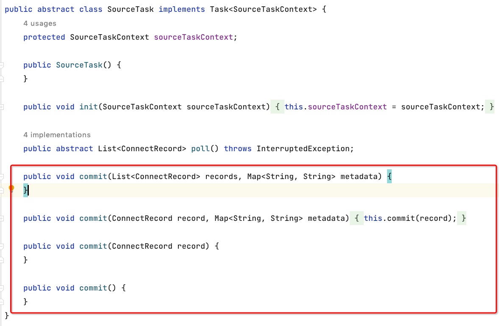

## 简介
> RocketMQ Connect是一种特别强大的数据流处理的工具，属于RocketMQ生态的一部分，有了它，我们可以将RocketMQ同其它的数据技术（例，mysql , elasticsearch、Hudi等）轻松的进行结合，RocketMQ Connect使用 source插件将数据发送到RocketMQ的Topic中，并可通过sink 监听 Topic将数据写入到下游的数据存储中，过程中无需代码即可实现RocketMQ与其它技术的整合

## 特性
- 通用性
> 通过source和sink api规范化了其它数据系统和RocketMQ的集成，简化了连接器的开发、部署和管理
- 断点续传
> 自动管理位移的提交，不需要开发人员干预；当任务停止或者服务停机升级，重新启动任务会从上次保存的位点进行消费
- 分布式，高可用
> 分布式模式下，支持任务的分布式部署，通过简单hash或者一致性hash的方式在集群中对任务进行均匀分布，当一个worker宕机，任务会进行重新平衡到其它的worker节点中，保证了任务的正常运行
- 支持API管理
> RocketMQ Connect提供了丰富的connector集群任务管理的api ，包含但不限于任务添加，启停、列表等操作，帮助用户自定义管理后台
- 批流一体
> RocketMQ Connect可将批处理转换成流的统一形式进行数据的传输和集成
- 支持Standalone/Distributed两种模式：
> RocketMQ Connect支持两种模式，分别是Standalone 和 Distributed,Standalone主要用于测试环境，Distributed用于生产环境
- 支持Dead Letter Queue:
> RocketMQ Connect Sink 支持处理运行过程中出现的错误的数据进入指定的topic，用于错误数据的监听和手工修复
## 组件
- Worker
> 执行连接器和任务运行进程
- Connector
> 通过管理任务来协调数据流的高级抽象
- Task
> 分为SourceTask定义如何从数据源中poll数据到RocketMQ Topic中。SinkTask定义如何将Topic数据写入到对应的目标数据源中
- Record Converter
> 用于在RocketMQ Connect 和发送或接收数据的系统之间进行数据的转换
- Transform
> 改变由连接器产生或发送到连接器的每条消息的简单逻辑，如映射，过滤，路由，重命名等操作，可设置多个
## 一条数据的流转


## 版本升级(0.1.4)

### api升级[openmessaging/openconnect] 
- [增强] https://github.com/openmessaging/openconnect/issues/41
> 1.增强SchemaBuilder能力，支持所有FieldType声明类型schema的快速构建, 支持struct、array、map复杂类型的快速构建

```Struct 类型 schema 构建
 io.openmessaging.connector.api.data.Schema schema = SchemaBuilder.struct()
                .name("test")
                .defaultValue("")
                .optional()
                .doc("this is a demo")
                .field("string-field", SchemaBuilder.string().build())
                .field("bool-field", SchemaBuilder.bool().build())
                .build();
```
> 2.统一struct构建方式，帮助快速完成struct的构建

```Struct填充方式
 io.openmessaging.connector.api.data.Schema schema = SchemaBuilder.struct()
                .name("test")
                .defaultValue("")
                .optional()
                .doc("this is a demo")
                .field("string-field", SchemaBuilder.string().build())
                .field("bool-field", SchemaBuilder.bool().build())
                .build();

        Struct struct = new Struct(schema);
        struct.put("string-field", "test");
        struct.put("string-field", true);
```

- [新特性] https://github.com/openmessaging/openconnect/issues/43
> 增加错误上报的api，允许 sink task 自定义上报错误数据信息到指定的错误topic中;

>> [SinkTaskContext](https://github.com/openmessaging/openconnect/blob/master/connector/src/main/java/io/openmessaging/connector/api/component/task/sink/SinkTaskContext.java)


-[增强] https://github.com/openmessaging/openconnect/issues/51

> 优化SourceTask commit 上报api , 允许透出record 发送相关属性，帮助用户自维护offset信息
>> [SourceTask](https://github.com/openmessaging/openconnect/blob/master/connector/src/main/java/io/openmessaging/connector/api/component/task/source/SourceTask.java)


-[增强] https://github.com/openmessaging/openconnect/issues/53
> 增加 key field用来表示数据的唯一性，并用来保证有序
>> [ConnectRecord](https://github.com/openmessaging/openconnect/blob/master/connector/src/main/java/io/openmessaging/connector/api/data/ConnectRecord.java)

### Runtimme升级

-[新特性] https://github.com/apache/rocketmq-connect/issues/93

[rocketmq-connect-debezium](https://github.com/apache/rocketmq-connect/tree/master/connectors/rocketmq-connect-debezium)

```
Debezium插件支持, 支持在RocketMQ Connect 使用 debezium 及 transform来进行数据的拉取和转换 
```

|                                            | snapshot.mode                           | 锁状态          | doc                                                                   |
|:-------------------------------------------|:----------------------------------------|--------------|-----------------------------------------------------------------------|
| 增量                                         | never, schema_only,schema_only_recovery | Schema快照时需要锁表 |                                                                       |
| 全量快照 + 增量                                  | initial,when_needed                     | 全局锁 或者 全表锁   |                                                                       |
| 增强快照                                       | schema_only                             | 无锁           | https://debezium.io/blog/2021/10/07/incremental-snapshots/            |
| Read only增量快照(只mysql,RocketMQ Connect暂不支持) | schema_only                             | 无锁           | https://debezium.io/blog/2022/04/07/read-only-incremental-snapshots/  |

[Debezium增量快照设计](https://github.com/debezium/debezium-design-documents/blob/main/DDD-3.md)
[DBLog设计](https://www.modb.pro/db/432212)

*** io.debezium.relational.RelationalSnapshotChangeEventSource.doExecute *** 
可以看到具体的执行步骤

-[Bug] https://github.com/apache/rocketmq-connect/issues/143
```
 修复offset上报问题，保证相同名称的connector在集群中上报的名称是
```

-[增强] https://github.com/apache/rocketmq-connect/issues/147
```
Transformchain 添加 stop 方法， 用于在connector关闭时卸载自定义的对象和关闭自定义的连接
```

-[新特性] https://github.com/apache/rocketmq-connect/issues/153
[rocketmq-connect-jdbc](https://github.com/apache/rocketmq-connect/tree/master/connectors/rocketmq-connect-jdbc)
```
rocketmq-connect-jdbc升级，增加jdbc插件抽象，通过spi方式扩展对不同存储的支持

```

-[新特性] https://github.com/apache/rocketmq-connect/issues/155
 
增加RecordConverter，实现传输数据的转换，目前支持一下内置Record Converter

***自定义***： 实现io.openmessaging.connector.api.data.RecordConverter

``` 使用方式
 "value.converter": "org.apache.rocketmq.connect.runtime.converter.record.json.JsonConverter",
 "key.converter": "org.apache.rocketmq.connect.runtime.converter.record.json.JsonConverter"

-------------------Catalog---------------------------------- 
 {
    "schema":{
        "name":"server_026.test_database.employee_copy3.Value",
        "optional":true,
        "type":"struct",
        "fields":[
            {
                "field":"id",
                "optional":true,
                "type":"int64"
            },
            {
                "field":"name",
                "optional":true,
                "type":"string"
            },
            {
                "field":"howold",
                "optional":true,
                "type":"int32"
            },
            {
                "optional":true,
                "field":"male",
                "type":"int32"
            },
            {
                "optional":true,
                "field":"company",
                "type":"string"
            },
            {
                "field":"money",
                "optional":true,
                "type":"double"
            },
            {
                "field":"begin_time",
                "name":"io.debezium.time.Timestamp",
                "optional":true,
                "type":"int64"
            },
            {
                "field":"modify_time",
                "name":"io.debezium.time.ZonedTimestamp",
                "optional":true,
                "type":"string"
            }
        ]
    },
    "payload":{
        "id":12,
        "name":"name-06",
        "howold":19,
        "male":3,
        "company":null,
        "money":0,
        "begin_time":null,
        "modify_time":"2022-06-14T11:57:51Z"
    }
}
```

``` 支持的类型
[Json     ] org.apache.rocketmq.connect.runtime.converter.record.json.JsonConverter
[String   ] org.apache.rocketmq.connect.runtime.converter.record.StringConverter
[Short    ] org.apache.rocketmq.connect.runtime.converter.record.ShortConverter
[Long     ] org.apache.rocketmq.connect.runtime.converter.record.LongConverter
[Integer  ] org.apache.rocketmq.connect.runtime.converter.record.IntegerConverter
[Float    ] org.apache.rocketmq.connect.runtime.converter.record.FloatConverter
[Double   ] org.apache.rocketmq.connect.runtime.converter.record.DoubleConverter
[ByteArray] org.apache.rocketmq.connect.runtime.converter.record.ByteArrayConverter
```


-[增强] https://github.com/apache/rocketmq-connect/issues/183

```
[ 1.] 优化WorkerSourceTask 和 WorkerSinkTask，抽象状态管理
[ 2.] 优化CommitRecord，允许用户自定义 offset 维护方式
[ 3.] WorkerSourceTask offset 提交保证有序
[ 4.] WorkerSourceTask 增加 topic检查和创建的功能，用于支持单任务多topic路由支持
[ 5.] WorkerDirectTask 优化 offset 提交
```

-[增强] https://github.com/apache/rocketmq-connect/issues/207
```
[ 1.] ConnectRecord增加Key字段的定义，用于维护传输数据的唯一标识，标识可以是数据表的主键，可以是通过transform生成的UUID或者是通过transform组装的联合主键
[ 2.] RecordConverter支持key的序列化和反序列化
```

-[增强] https://github.com/apache/rocketmq-connect/issues/223

添加一些常用的transform，方便大家可以按照模板去实现自己的transform

Transform配置案例[单个配置]
```
"transforms": "Replace",
"transforms.Replace.field.pattern": "company",
"transforms.Replace.field.replacement": "company02",
"transforms.Replace.class": "org.apache.rocketmq.connect.transforms.PatternRename$Value",
```
Transform配置案例[多个配置],会按照配置顺序依次执行
```
"transforms": "Replace, Replace02",
"transforms.Replace.field.pattern": "company",
"transforms.Replace.field.replacement": "company02",
"transforms.Replace.class": "org.apache.rocketmq.connect.transforms.PatternRename$Value",
"transforms.Replace02.field.pattern": "company02",
"transforms.Replace02.field.replacement": "company03",
"transforms.Replace02.class": "org.apache.rocketmq.connect.transforms.PatternRename$Value",
```
1. transforms: 为固定配置,不可变
2. Replace, Replace02: 为配置名称，可自定义, 多个用","分割，若为多个，下面配置均需重复配置
3. transforms.${transform-name}.class: 用此配置来表示transform的class
4. transforms.${transform-name}.{config.key}: transform中定义的实际的配置项；

``` 已经支持的transform
org.apache.rocketmq.connect.transforms.ChangeCase$Key 
org.apache.rocketmq.connect.transforms.ChangeCase$Value 
org.apache.rocketmq.connect.transforms.ExtractNestedField$Value 
org.apache.rocketmq.connect.transforms.ExtractNestedField$Key 
org.apache.rocketmq.connect.transforms.PatternRename$Key 
org.apache.rocketmq.connect.transforms.PatternRename$Value 
org.apache.rocketmq.connect.transforms.PatternFilter$Key 
org.apache.rocketmq.connect.transforms.PatternFilter$Value 
org.apache.rocketmq.connect.transforms.SetMaximumPrecision$Key 
org.apache.rocketmq.connect.transforms.SetMaximumPrecision$Value
```

-[增强] https://github.com/apache/rocketmq-connect/issues/230
```
[ 1.] 添加Converter和Transform的加载
[ 2.] 添加一些必要的校验
[ 3.] 提供rest API获取插件列表
```

-[增强] https://github.com/apache/rocketmq-connect/issues/233
```
实现相同key数据的发送是有序的；满足业务应用中同一条数据的CRUD可以按照更新的时间线去发送
```

-[新特性] https://github.com/apache/rocketmq-connect/issues/238

增加Pause 和 Resume 能力，Rest API返回标准化 
```
[ 1.] 优化WorkerSourceTask 增加 pause 和 resume的功能，提供source task 状态上报能力
[ 2.] 优化WorkerSinkTask 并将 Rocketmq Consumer 替换成DefaultLitePullConsumer, 以使用 pause 、resume 及seek 功能，优化commit 提交流程，提供sink task状态上报能力
[ 3.] 优化WorkerConnector, 增加 pause 和 resume 维护功能，提供connector 状态上报能力
[ 4.] 增加 StateManagementService 状态管理服务，帮助缓存和向集群传输connector 和 task 任务的状态，并用于rest api状态透出
[ 5.] 优化ConfigManagementServiceImpl，将异步每次发送全量配置改为每次只发送变更connector，为了解决配置任务过多而触发的消息body的限制，每次任务的变更以监听的消息为准
[ 6.] 优化AbstractConnectController 添加接口供rest api使用
[ 7.] 标准化rest api ，javalin 升级到>4.6 ，规范了api返回的数据格式，增加了pause 和resume 功能api实现
```

-[新特性] https://github.com/apache/rocketmq-connect/issues/255
```
统一配置、更新使用文档
```
| 原配置                | 新配置                | 描述                    |
|:-------------------|:-------------------|-----------------------|
| connector-class    | connector.class    |                       |
| max-task           | max.tasks          |                       |
| value-converter    | value.converter    |                       |
| key-converter      | key.converter      |                       |
| connect-topicname  | connect.topicname  | source指定发送topic       |
| connect-topicnames | connect.topicnames | sink 订阅topic，多个用","分割 |
| task-group-id      | task.group.id      |                       |

## Restful接口

### 集群信息
+ 查看集群节点信息：
> curl -X GET http://(your worker ip):(port)/getClusterInfo

```
{
    "status": 200,
    "body": [
        "DefaultWorker"
    ]
}
```
+ 重新加载Connector插件目录下的Connector包：
> curl -X GET http://(your worker ip):(port)/plugin/list
```
{
    "status": 200,
    "body": [
        {
            "className": "org.apache.rocketmq.connect.jdbc.connector.JdbcSinkConnector",
            "type": "SINK",
            "version": "undefined"
        },
        {
            "className": "org.apache.rocketmq.connect.debezium.mysql.DebeziumMysqlConnector",
            "type": "SOURCE",
            "version": "undefined"
        },
        {
            "className": "org.apache.rocketmq.connect.jdbc.connector.JdbcSourceConnector",
            "type": "SOURCE",
            "version": "undefined"
        },
        {
            "className": "org.apache.rocketmq.connect.transforms.ChangeCase$Key",
            "type": "TRANSFORMATION",
            "version": "undefined"
        },
        {
            "className": "org.apache.rocketmq.connect.transforms.ChangeCase$Value",
            "type": "TRANSFORMATION",
            "version": "undefined"
        },
        {
            "className": "org.apache.rocketmq.connect.transforms.ExtractNestedField$Key",
            "type": "TRANSFORMATION",
            "version": "undefined"
        },
        {
            "className": "org.apache.rocketmq.connect.transforms.ExtractNestedField$Value",
            "type": "TRANSFORMATION",
            "version": "undefined"
        },
        {
            "className": "org.apache.rocketmq.connect.transforms.PatternFilter$Key",
            "type": "TRANSFORMATION",
            "version": "undefined"
        },
        {
            "className": "org.apache.rocketmq.connect.transforms.PatternFilter$Value",
            "type": "TRANSFORMATION",
            "version": "undefined"
        },
        {
            "className": "org.apache.rocketmq.connect.transforms.PatternRename$Key",
            "type": "TRANSFORMATION",
            "version": "undefined"
        },
        {
            "className": "org.apache.rocketmq.connect.transforms.PatternRename$Value",
            "type": "TRANSFORMATION",
            "version": "undefined"
        },
        {
            "className": "org.apache.rocketmq.connect.runtime.converter.record.ByteArrayConverter",
            "type": "CONVERTER",
            "version": "undefined"
        },
        {
            "className": "org.apache.rocketmq.connect.runtime.converter.record.DoubleConverter",
            "type": "CONVERTER",
            "version": "undefined"
        },
        {
            "className": "org.apache.rocketmq.connect.runtime.converter.record.FloatConverter",
            "type": "CONVERTER",
            "version": "undefined"
        },
        {
            "className": "org.apache.rocketmq.connect.runtime.converter.record.IntegerConverter",
            "type": "CONVERTER",
            "version": "undefined"
        },
        {
            "className": "org.apache.rocketmq.connect.runtime.converter.record.LongConverter",
            "type": "CONVERTER",
            "version": "undefined"
        },
        {
            "className": "org.apache.rocketmq.connect.runtime.converter.record.ShortConverter",
            "type": "CONVERTER",
            "version": "undefined"
        },
        {
            "className": "org.apache.rocketmq.connect.runtime.converter.record.StringConverter",
            "type": "CONVERTER",
            "version": "undefined"
        },
        {
            "className": "org.apache.rocketmq.connect.runtime.converter.record.json.JsonConverter",
            "type": "CONVERTER",
            "version": "undefined"
        }
    ]
}

```
+ 列举所有Connector的插件
> curl -X GET http://(your worker ip):(port)/plugin/list/connectors
```
{
    "status": 200,
    "body": [
        {
            "className": "org.apache.rocketmq.connect.jdbc.connector.JdbcSinkConnector",
            "type": "SINK",
            "version": "undefined"
        },
        {
            "className": "org.apache.rocketmq.connect.debezium.mysql.DebeziumMysqlConnector",
            "type": "SOURCE",
            "version": "undefined"
        },
        {
            "className": "org.apache.rocketmq.connect.jdbc.connector.JdbcSourceConnector",
            "type": "SOURCE",
            "version": "undefined"
        }
    ]
}

```
+ 重新加载Connector插件目录下的Connector包：
> curl -X GET http://(your worker ip):(port)/plugin/reload
```
略
```

### Connector/Task管理

+ 创建或更新connector（存在且配置不同会更新，不存在创建）
> curl -X GET http://(your worker ip):(port)/connectors/{connectorName}
```
http://127.0.0.1:8082/connectors/employee-04446
{
    "connector.class":"org.apache.rocketmq.connect.jdbc.connector.JdbcSourceConnector",
    "max.tasks":"1",
    "connect.topicname":"test-topic-02",
    "connection.url":"jdbc:mysql://{host}:{port}",
    "connection.user":"******",
    "connection.password":"*******",
    "table.whitelist":"{db}.{table}",
    "mode": "incrementing",
    "incrementing.column.name":"id",
    "transforms": "Replace",
    "transforms.Replace.field.pattern": "company",
    "transforms.Replace.field.replacement": "company02",
    "transforms.Replace.class": "org.apache.rocketmq.connect.transforms.PatternRename$Value",
    "key.converter":"org.apache.rocketmq.connect.runtime.converter.record.json.JsonConverter",
    "value.converter":"org.apache.rocketmq.connect.runtime.converter.record.json.JsonConverter"
}
```
+ Pause(暂停)指定的connector
>curl -X GET http://(your worker ip):(port)/connectors/{connectorName}/pause
```
http://127.0.0.1:8082/connectors/employee-04446/pause
{
    "status": 200,
    "body": "Connector [employee-04446] paused successfully"
}

-------------状态查看-------------

{
    "status": 200,
    "body": {
        "name": "employee-04446",
        "connector": {
            "state": "PAUSED",
            "trace": null,
            "workerId": "standalone-worker"
        },
        "tasks": [
            {
                "state": "PAUSED",
                "trace": null,
                "workerId": "standalone-worker",
                "id": 0
            }
        ],
        "type": "SOURCE"
    }
}

```
+ Resume(重启)指定的connector
> curl -X GET http://(your worker ip):(port)/connectors/{connectorName}/resume
```
http://127.0.0.1:8082/connectors/employee-04446/resume
{
    "status": 200,
    "body": "Connector [employee-04446] resumed successfully"
}

-------------状态查看-------------

{
    "status": 200,
    "body": {
        "name": "employee-04446",
        "connector": {
            "state": "RUNNING",
            "trace": null,
            "workerId": "standalone-worker"
        },
        "tasks": [
            {
                "state": "RUNNING",
                "trace": null,
                "workerId": "standalone-worker",
                "id": 0
            }
        ],
        "type": "SOURCE"
    }
}


```
+ Pause(暂停)所有的connector
>curl -X GET http://(your worker ip):(port)/connectors/pause/all

+ Resume(重启)所有的connector
>curl -X GET http://(your worker ip):(port)/connectors/resume/all


+ 停止并删除指定的connector(谨慎使用)
> curl -X GET http://(your worker ip):(port)/connectors/{connectorName}/stop
```
http://127.0.0.1:8082/connectors/employee-04446/stop
{
    "status": 200,
    "body": "Connector [employee-04446] deleted successfully"
}
```
+ 停止并删除所有的connector(谨慎使用)
>curl -X GET http://(your worker ip):(port)/connectors/stop/all

+ 列举集群中所有connector信息
> curl -X GET http://(your worker ip):(port)/connectors/list
```
http://127.0.0.1:8082/connectors/list
{
    "status": 200,
    "body": {
        "employee-04446": {
            "status": {
                "name": "employee-04446",
                "connector": {
                    "state": "RUNNING",
                    "trace": null,
                    "workerId": "standalone-worker"
                },
                "tasks": [
                    {
                        "state": "RUNNING",
                        "trace": null,
                        "workerId": "standalone-worker",
                        "id": 0
                    }
                ],
                "type": "SOURCE"
            },
            "info": {
                "name": "employee-04446",
                "config": {
                    "connector.class": "org.apache.rocketmq.connect.jdbc.connector.JdbcSourceConnector",
                    "incrementing.column.name": "id",
                    "transforms.Replace.field.replacement": "company02",
                    "connection.url": "jdbc:mysql://{host}:{port}",
                    "connection.user": “********”,
                    "connection.password": “*******”,
                    "transforms": "Replace",
                    "transforms.Replace.delete.handling.mode": "none",
                    "table.whitelist": "{db.name}.{table.name}",
                    "mode": "incrementing",
                    "transforms.Replace.class": "org.apache.rocketmq.connect.transforms.PatternRename$Value",
                    "max.tasks": "1",
                    "update.timestamp": "1661398218574",
                    "connect.topicname": "test-topic-02",
                    "transforms.Replace.field.pattern": "company",
                    "value.converter": "org.apache.rocketmq.connect.runtime.converter.record.json.JsonConverter",
                    "key.converter": "org.apache.rocketmq.connect.runtime.converter.record.json.JsonConverter"
                },
                "tasks": [
                    {
                        "connector": "employee-04446",
                        "task": 0
                    }
                ],
                "type": "SOURCE"
            }
        }
    }
}

```
+ 根据connectorName获取connector的配置信息
> curl -X GET http://(your worker ip):(port)/connectors/{connectorName}/config
```
http://127.0.0.1:8082/connectors/employee-04446/config

{
    "status": 200,
    "body": {
        "name": "employee-04446",
        "config": {
            "connector.class": "org.apache.rocketmq.connect.jdbc.connector.JdbcSourceConnector",
            "incrementing.column.name": "id",
            "transforms.Replace.field.replacement": "company02",
            "connection.url": "jdbc:mysql://{host}:{port}",
            "connection.user": “******”,
            "connection.password": “******”,
            "transforms": "Replace",
            "transforms.Replace.delete.handling.mode": "none",
            "table.whitelist": "{db.name}.{table.name}",
            "mode": "incrementing",
            "transforms.Replace.class": "org.apache.rocketmq.connect.transforms.PatternRename$Value",
            "max.tasks": "1",
            "connect.topicname": "test-topic-02",
            "transforms.Replace.field.pattern": "company",
            "value.converter": "org.apache.rocketmq.connect.runtime.converter.record.json.JsonConverter",
            "key.converter": "org.apache.rocketmq.connect.runtime.converter.record.json.JsonConverter"
        },
        "tasks": [
            {
                "connector": "employee-04446",
                "task": 0
            }
        ],
        "type": "SOURCE"
    }
}
```
+ 根据connectorName获取connector的状态
> curl -X GET http://(your worker ip):(port)/connectors/{connectorName}/status
```
http://127.0.0.1:8082/connectors/employee-04446/status
{
    "status": 200,
    "body": {
        "name": "employee-04446",
        "connector": {
            "state": "RUNNING",
            "trace": null,
            "workerId": "standalone-worker"
        },
        "tasks": [
            {
                "state": "RUNNING",
                "trace": null, // 错误堆栈信息
                "workerId": "standalone-worker",
                "id": 0
            }
        ],
        "type": "SOURCE"
    }
}
```
+ 根据connectorName获取connector下所有task信息
> curl -X GET http://(your worker ip):(port)/connectors/{connectorName}/tasks
```
http://127.0.0.1:8082/connectors/employee-04446/tasks
{
    "status": 200,
    "body": [
        {
            "id": {
                "connector": "employee-04446",
                "task": 0
            },
            "config": {
               // 详细配置信息
            }
        }
    ]
}


```

+ 根据connectorName和task id获取task状态
> curl -X GET http://(your worker ip):(port)/connectors/{connectorName}/tasks/{task}/status
```
http://127.0.0.1:8082/connectors/employee-04446/tasks/0/status
{
    "status": 200,
    "body": {
        "state": "RUNNING",
        "trace": null,
        "workerId": "standalone-worker",
        "id": 0
    }
}
```

+ 获取当前worker分配的connector信息
```
curl -X GET http://(your worker ip):(port)/allocated/connectors
```

+ 获取当前worker分配的task信息
```
curl -X GET http://(your worker ip):(port)/allocated/tasks
```


## 未来规划

* 支持 Schema registry[进行中] [ISSUE #270](https://github.com/apache/rocketmq-connect/issues/270)
> 适配io.openmessaging.connector.api.data.RecordConverter, 优先支持json、avro两种方式 
* 支持 Compact topic
> RocketMQ Connect 存储支持Compact topic
* Converter 替换成 RecordConverter [进行中] [ISSUE #252](https://github.com/apache/rocketmq-connect/issues/252)
> 将存储中使用的Converter全部替换成RecordConverter，全局统一，只维护一种转换方式 
* Jdbc插件持续扩展
> 计划增加 pg、oracle、sqlserver等关系型数据库的支持，非关系型数据库按需扩展
* Debezium插件持续支持
> Read only模式增量快照
> 
> 支持通过debezium api 自定义 CDC 的插件
* WorkerSourceTask 支持 exactly-once(只执行一次)的提交方式 [ISSUE #185](https://github.com/apache/rocketmq-connect/issues/185)
> 当前的模式是最少一次提交，当前模式下只能保证数据不丢，但可能会存在重复拉取
* Docker下运行支持[进行中]  [ISSUE #215](https://github.com/apache/rocketmq-connect/issues/215)
> 支持docker下的快速部署和任务调试，帮助使用者快速完成任务的调试
* RocketMQ Connect operator
>
* 补全指标， 增加Metrics Reporter
> 由于重构造成了很多执行过程的指标被遗漏，需要及时补全
> 
> 系统通过自定义 reporter， 上报指标信息，比如上报到指定的topic ,上报到数据库等


